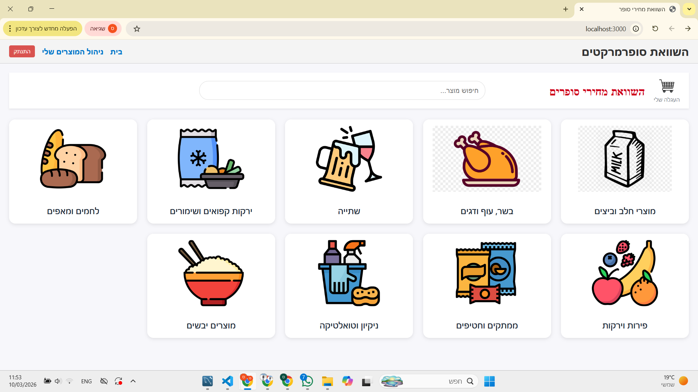
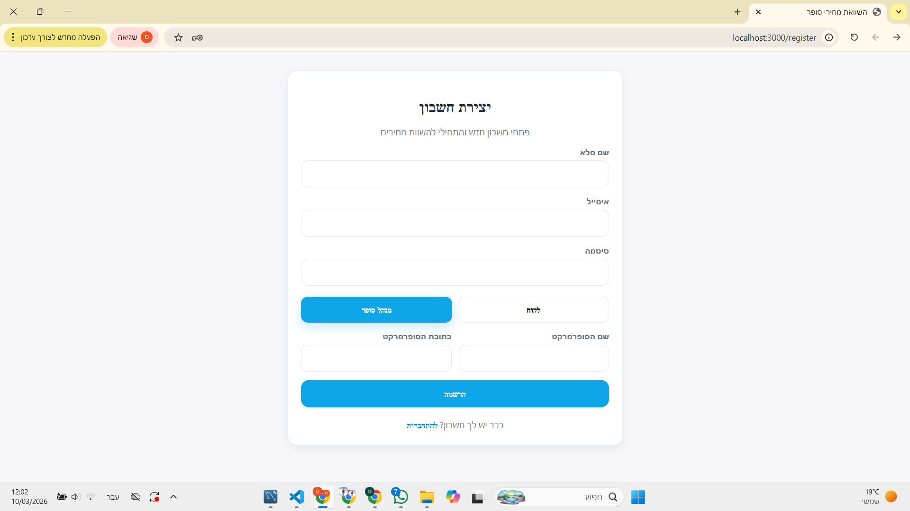
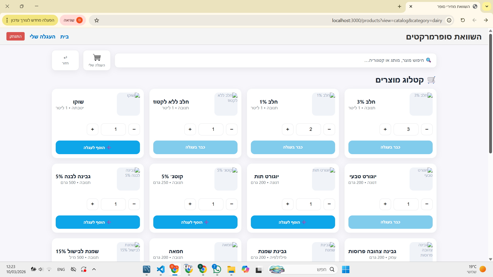
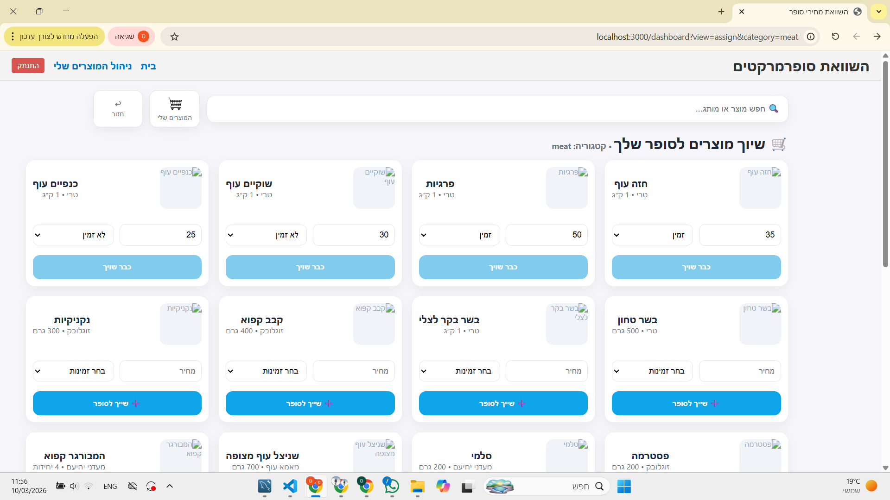
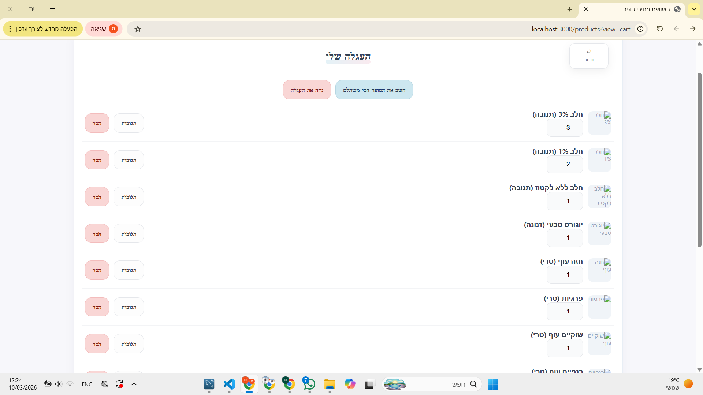
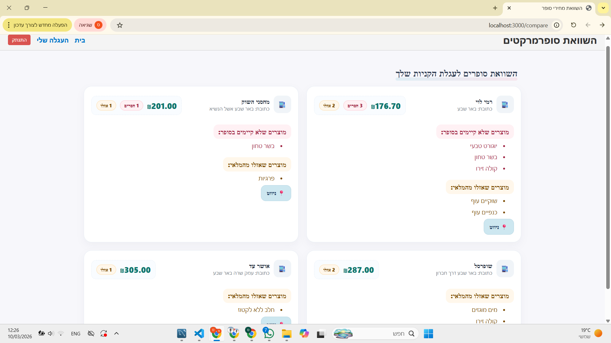
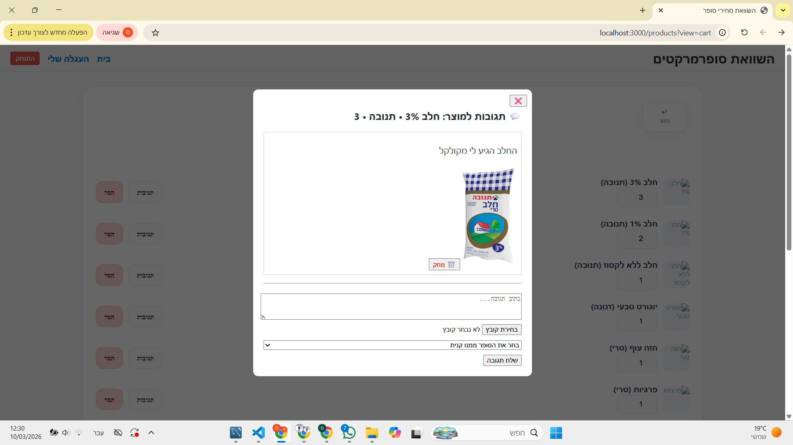
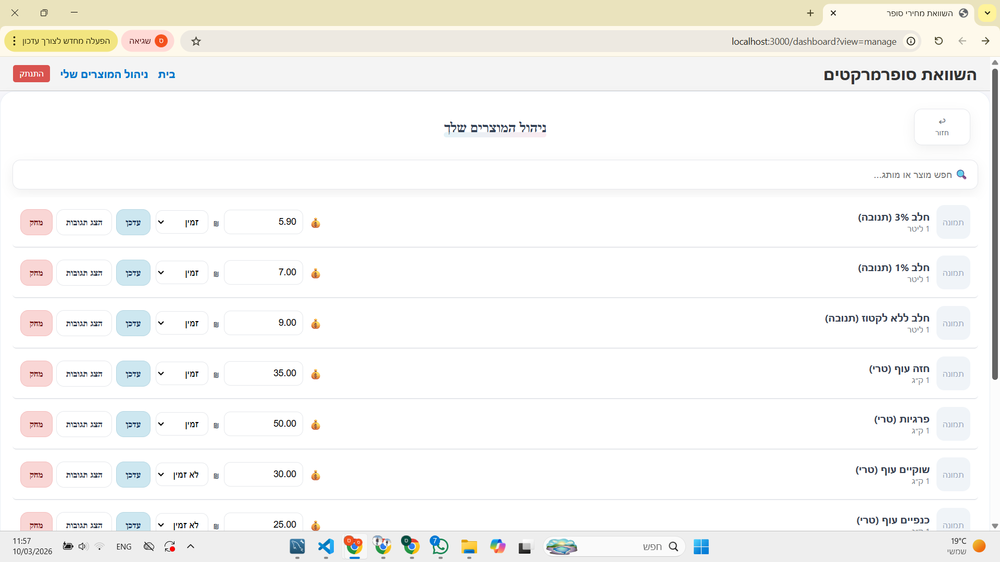

# Supermarket Comparator

Full-stack web platform for **comparing basket prices across supermarkets** with separate flows for **customers** and **store managers**.

## Key Features
- **Customer flow**: browse products, build a basket, and compare total cost across supermarkets (including missing items)
- **Manager flow**: manage supermarket products (CRUD), update prices/availability
- **Reviews & images**: customers can add product reviews and upload images
- **Auth & roles**: JWT authentication + role-based authorization (customer/manager)
- **REST API**: Express server with MySQL persistence

## Screenshots
<p align="center">
  
  
</p>

<p align="center">
  
  
</p>

<p align="center">
  
  
</p>

<p align="center">
  
  
</p>

## Tech Stack
**Frontend:** React, React Router, Axios  
**Backend:** Node.js, Express, JWT  
**Database:** MySQL  
**Other:** Multer (image upload)

## Run Locally

### 1) Clone
```bash
git clone https://github.com/sapirShifrin/supermarket_comparator.git
cd supermarket_comparator
```

### 2) Server environment

Create server/.env based on server/.env.example.

### 3) Install & run server
```bash
cd server
npm install
npm start
```

### 4) Install & run client

Open a new terminal:
```bash
cd client
npm install
npm start
```

Client runs on `http://localhost:3000`  
Server runs on `http://localhost:5000`

## Environment Variables
See `server/.env.example` for required variables:
- `PORT`
- `DB_HOST`
- `DB_USER`
- `DB_PASS`
- `DB_NAME`
- `JWT_SECRET`

## Project Structure
- `client/` – React app
- `server/` – Express API + MySQL
- `docs/` – screenshots for README

## Highlights (for recruiters)
- Implemented **role-based access control** (customer vs. manager)
- Built a **basket comparison engine** (total cost + missing items)
- Added **image-backed reviews** using secure upload handling